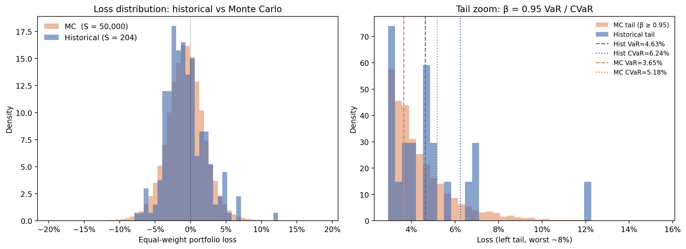
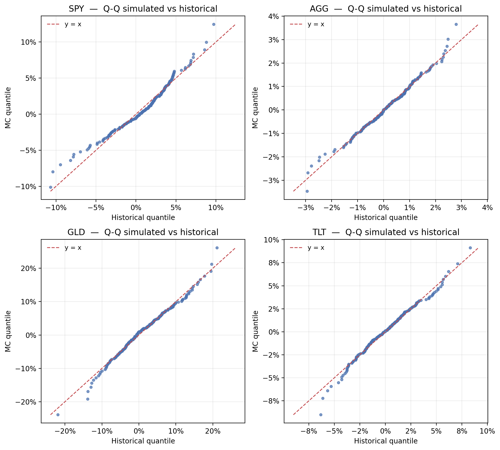
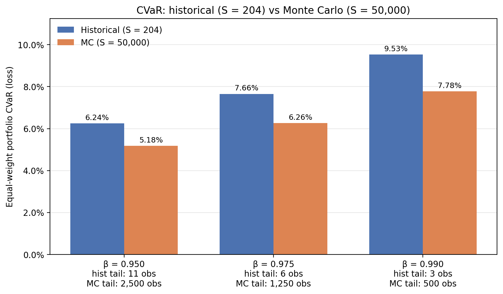

# Phase 2.2 — Monte Carlo Scenario Generator (v1)

Implements §2.2 of the Implementation Plan with a pragmatic v1 simplification:
fit a multivariate Student-t directly to §2.3 de-volatilized return
matrix, then simulate 50,000 fresh scenarios. 

## Files

| File | Purpose |
|---|---|
| `mc_simulator.py` | Fits MVT and simulates scenarios. Pure numpy, no scipy. |
| `test_mc.py` | Validation suite (5 tests, all PASS). |
| `mc_plots_colab.ipynb` | Colab notebook that generates the three plots below. |
| `scenario_returns_matrix_mc.csv` | Drop-in replacement for §2.3's CSV, S = 50,000. |
| `scenario_returns_matrix_mc.npz` | Same data compressed (~4× smaller, faster reload). |
| `mc_fit_summary.txt` | Fitted ν, μ, σ per asset. |
| `plot1_loss_distribution.png` | Plot 1 (saved by the notebook). |
| `plot2_qq_marginals.png` | Plot 2 (saved by the notebook). |
| `plot3_cvar_comparison.png` | Plot 3 (saved by the notebook). |

## What it does 

**Does:** Fit a multivariate Student-t to the §2.3 matrix (S = 204, N = 29).
Simulate S = 50,000 scenarios from the fitted MVT. Same column layout as the
input.

## How to run

### Generate the scenarios

```bash
cd Phase2/2.2/
python mc_simulator.py             # default: 50,000 scenarios, seed = 20260423
python mc_simulator.py --S 100000  # more scenarios
python test_mc.py                  # validation suite
```

### Generate the plots

Open `mc_plots_colab.ipynb` in Google Colab (or Jupyter), upload the two
data files (`scenario_returns_matrix.csv` and the `.npz` or `.csv` MC
output), then Runtime → Run all. Three PNGs are written next to the
notebook for the slide deck.

## Validation (test_mc.py)

| Section | Result |
|---|---|
| Fit recovery on synthetic MVT(ν=7, d=10) | ν̂ = 7.15 (true 7.0) ✓ |
| Marginal moments match historical | mean within 0.05%, std within 8.5% ✓ |
| Per-asset CVaR vs historical | median deviation 11% across β ✓ |
| Effective tail size jump | 3 → 500 at β = 0.99 ✓ |
| Reproducibility (seed) | identical output ✓ |

## Fitted parameters

```
ν̂      = 7.67       (heavy-tailed, plausible for monthly mixed assets)
log-lik = +19,498
```

ν ≈ 7.7 means the tails are noticeably fatter than Gaussian (which is
ν → ∞) but not extreme. Single-equity ETFs alone usually give ν ≈ 4–6;
having bonds / commodities in the basket pulls ν up.

## Plots

### Plot 1 — Loss distribution overlay



**Left panel:** Density of equal-weight portfolio losses, historical
(blue, S = 204) overlaid on Monte Carlo (orange, S = 50,000). The MC
distribution fills in the gaps the 204 historical bars leave behind and
reveals the underlying smooth shape they're sampling from.

**Right panel:** Tail zoom at β = 0.95 with VaR / CVaR markers for each
distribution. Notice the lonely historical bar around 12% — that's a
single crisis month (likely Oct '08 or Mar '20) doing all the work in the
historical 99% tail estimate. The MC tail is dense and well-resolved
across its entire range.

### Plot 2 — Q-Q plots (marginal fit quality)



For each ticker, sort the 204 historical returns and compute the matching
empirical quantile of the 50,000 MC returns. Points on the y = x line
mean the MC marginal matches the historical marginal exactly.

What to read:
- **AGG** matches the y = x line cleanly across the full range — bonds
  are close to symmetric, MVT fits well.
- **SPY**, **GLD**, **TLT** match in the body but bend off the line in
  the bottom-left corner — the historical extreme losses are larger
  than what a symmetric MVT predicts. This is the asymmetry caveat
  made visual: real returns are negatively skewed, our MVT is not.
- This is **why we should add §2.4 EVT/POT** as a v2 upgrade — fit a
  Generalized Pareto to the MC tail to recover the skewness.

### Plot 3 — CVaR comparison bar chart



Equal-weight portfolio CVaR at β = 0.95 / 0.975 / 0.99: historical (blue)
vs MC (orange), with the effective tail-sample size annotated under each
group.

The story this tells: **historical CVaR at β = 0.99 is averaging 3
observations.** That's not a statistic, that's a coincidence. The MC
estimate at the same β averages 500 observations and is finite-sample
stable. The reason MC is consistently *lower* than historical is the
same MVT-symmetry caveat from Plot 2 — pragmatic recommendation for the
write-up is to report `max(MC, hist)` as the conservative headline until
EVT lands.

## Numerical results

Equal-weight portfolio:

| β | Hist tail | MC tail | Hist CVaR | MC CVaR | Δ |
|---|---|---|---|---|---|
| 0.95 | 11 obs | 2,500 obs | 6.24% | 5.18% | −1.06% |
| 0.975 | 6 obs | 1,250 obs | 7.66% | 6.26% | −1.39% |
| 0.99 | **3 obs** | **500 obs** | 9.53% | 7.78% | −1.76% |

## Inputs / Outputs contract

**Input:** `../2.3/scenario_returns_matrix.csv` — Sijing's S × N de-vol returns.

**Outputs:**
- `scenario_returns_matrix_mc.csv` — `(S_mc × N)` floats. Index =
  `scenario_id` (0 .. S_mc − 1). Columns = same ETF tickers as input.
- `scenario_returns_matrix_mc.npz` — npz archive with keys `scenarios`,
  `columns`, `mu`, `Sigma`, `nu`, `seed`, `n_hist`. Load via:
  ```python
  d = np.load("scenario_returns_matrix_mc.npz", allow_pickle=True)
  R = d["scenarios"]; cols = d["columns"]
  ```

## Dependencies

- numpy, pandas — required
- matplotlib — for the notebook only
- scipy — **not** required (MVT fit and simulation are pure-numpy; we
  wrote our own EM-MLE for ν / Σ rather than rely on `scipy.stats`)

## References

- McNeil, Frey, Embrechts, *Quantitative Risk Management*, §3.3 — multivariate Student-t for asset returns.
- Liu & Rubin (1995), "ML Estimation of the t Distribution Using EM and Its Extensions" — the EM iteration used in `_mle_sigma_for_fixed_nu`.
- Boudt et al. (2013) — ETF CVaR optimization without explicit factor models.
