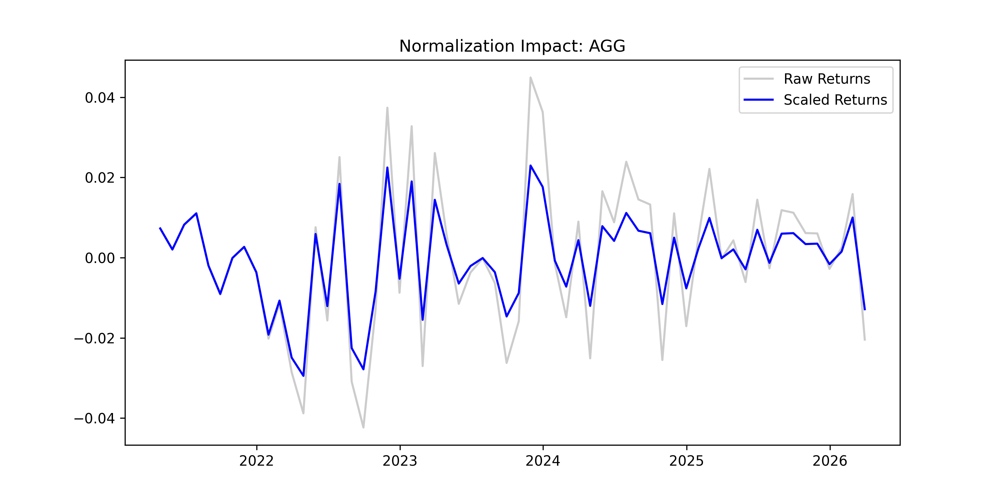
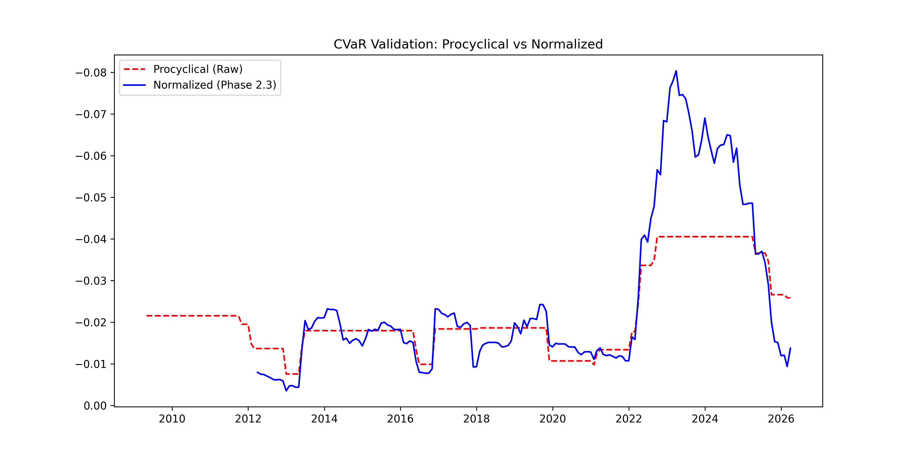

# Phase 2.3 - Volatility Scaling & Forward-Looking CVaR Simulation

## 1. Overview
The primary objective of this module is to mitigate the **procyclicality bias** inherent in traditional Historical Simulation (HS). Raw historical return series often fail to reflect immediate market dynamics, leading to severe lag in risk estimates—specifically underestimating tail risk immediately before a market crash and overestimating it long after the crisis has passed.

This implementation adopts a **Volatility Scaling** framework inspired by the Hull-White (1998) methodology. By standardizing historical returns into "regime-neutral" signals and subsequently re-projecting them onto the current short-term volatility environment, the model ensures that empirical tail risk estimates are both anchored in historical stress events and adapted to the current market regime. This serves as a critical calibration step to provide high-fidelity risk inputs for subsequent portfolio optimization.

---

## 2. Implementation Logic & Theory

Standard Historical Simulation operates under the assumption that historical asset returns are independent and identically distributed (i.i.d.). However, empirical financial returns exhibit strong volatility clustering (conditional heteroskedasticity). By filtering out historical volatility regimes, the underlying distribution is normalized to a stationary state, allowing for more stable and robust non-parametric tail estimation.

### I. Data Normalization (De-volatilization)
To strip away temporal variation in risk intensity, each historical log return $r_{i,t}$ is normalized by its long-horizon rolling standard deviation:

$$z_{i,t} = \frac{r_{i,t}}{\sigma_{i,t}^{long}}$$

* **$T_{long}$**: 36-month rolling window (capturing baseline unconditional historical volatility).
* **Metric**: Stationary Z-scores ($z_{i,t}$) that eliminate time-varying variance while preserving the joint empirical correlation structure and asset-specific tail distribution shapes.

### II. Adaptive Rescaling (Regime-Adjustment)
The filtered stationary Z-scores are then scaled upwards or downwards to align with the active volatility regime of the current trading environment:

$$\hat{r}_{i,t} = z_{i,t} \times \sigma_{i,current}^{short}$$

* **$T_{short}$**: 12-month rolling window (reflecting conditional immediate risk intensity).
* **Result**: An $S \times n$ adjusted scenario returns matrix ($\hat{r}_{i,t}$) where historical tail events (e.g., the 2008 Global Financial Crisis or 2020 Liquidity Crunch) are re-sized to show what they would look like if they occurred under today's specific market volatility.

---

## 3. Risk Metrics & Deliverables

### Multi-level CVaR Forecast
Using the dynamic scenario matrix, the system computes non-parametric **Conditional Value at Risk (CVaR)** across multiple confidence levels ($\beta = 95\%, 97.5\%, 99\%$) via the empirical lower $\alpha$-tail:

$$CVaR_{\beta} = E[R \mid R \le VaR_{\alpha}]$$

### Outputs
* **`scenario_returns_matrix.csv`**: Scaled scenario returns matrix ($S \times n$), serving as the direct input for the Phase 3.1 portfolio optimizer.
* **`cvar_forecast_summary.csv`**: Comprehensive summary table capturing multi-tier CVaR estimates across the targeted ETF universe calibrated to the current risk regime.

---

## 4. Validation & Empirical Interpretation

The empirical validity of the volatility-scaling engine is monitored and verified via two key validation plots saved within the repository:

### I. Variance Stabilization Verification
The variance adjustment results are shown in the plot below:



* **Analysis & Interpretation**: This plot contrasts the raw historical log returns (Gray) against the standardized, de-volatized series (Blue). The raw series displays alternating periods of compression and expansion, indicating strong non-stationarity and regime shifts. In contrast, the standardized Z-score series exhibits a highly consistent amplitude across the entire historical timeline. This stabilization confirms that time-varying conditional variance has been successfully neutralized, establishing a reliable, homogenous empirical distribution for baseline tail risk sampling.

### II. CVaR Responsiveness and Sensitivity Analysis
The comparative forecasting backtest results are shown in the plot below:



* **Analysis & Interpretation**: This plot benchmarks the performance of **Procyclical CVaR** (Unadjusted, Red Dashed line) against the **Normalized CVaR** (Phase 2.3, Blue Solid line). 
* **Key Findings**: The unadjusted model exhibits severe **"sample stickiness,"** represented by long horizontal plateaus. Because the absolute worst historical samples do not change frequently, the traditional model remains blind to sudden shifts in current market stress, creating a dangerous lag during volatility expansion. Conversely, the Normalized CVaR adapts dynamically and immediately to changing market regimes. By incorporating the short-horizon conditional volatility scaling, the model captures the 2022–2023 volatility spikes instantly, establishing a proactive and accurate capital buffer to protect the portfolio against tail-risk exposure.

---

## 5. Usage
To execute the full simulation pipeline, refresh data scaling, and export all deliverables, run:
```bash
python Historical_Simulation_with_Volatility.py
```